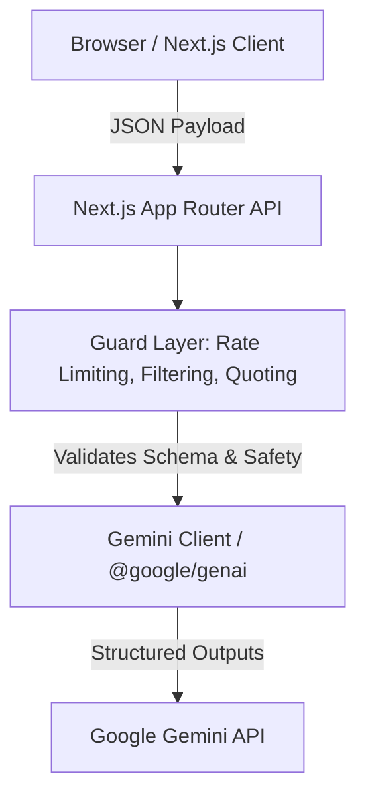

# LegalSense

LegalSense is an open-source, AI-assisted document analysis tool designed to help users quickly understand, compare, and navigate complex legal documents like leases, NDAs, and service agreements. It uses Google's Gemini models to provide plain-language summaries, detect material changes, flag risks, and ground answers in exact document citations. 

**Disclaimer**: This is general information, not legal advice. Consult a licensed attorney for your situation. (Verified in `src/lib/product/disclaimer.tsx`).

## Live Demo

A production deployment is available at [legalsense-six.vercel.app](https://legalsense-six.vercel.app). 
*(Note: The sample documents provided in the workspace demo feature (`src/lib/test-data.ts`) are entirely fictional.)*

## Problem Statement Alignment

LegalSense addresses seven core use cases to simplify document review.

| Use Case | UI Location | API Route | Pipeline/Function | Test File |
|---|---|---|---|---|
| **Simplify** | Document Workspace -> Summary tab | `/api/analyze` | `src/lib/guard/output-guard.ts` (`generateGuardedResponse`) | `src/app/api/__tests__/api.test.ts` |
| **Compare** | Document Workspace -> Compare tab | `/api/compare` | `src/lib/guard/output-guard.ts` (`generateGuardedResponse`) | `src/app/api/__tests__/api.test.ts` |
| **Highlight** | Document Workspace -> Clauses tab | `/api/analyze` | `src/lib/guard/output-guard.ts` (`generateGuardedResponse`) | `src/components/__tests__/DocumentAnalysis.test.tsx` |
| **Ask** | Document Workspace -> Q&A tab | `/api/qa` | `src/lib/guard/output-guard.ts` (`generateGuardedResponse`) | `src/app/api/__tests__/api.test.ts` |
| **Options and next steps** | Document Workspace -> Clauses (suggested questions) | `/api/analyze` | `src/lib/prompts.ts` (`CLAUSE_DETECTION_PROMPT`) | `evals/live.eval.ts` |
| **Actionable outputs** | Actionable Checklist (Print/Export) | Client-side only | `src/components/DocumentAnalysis.tsx` (Print styles) | `src/components/__tests__/DocumentAnalysis.test.tsx` |
| **Attorney preparation** | Q&A / Suggested Questions | `/api/analyze` | `src/lib/guard/output-guard.ts` (`generateGuardedResponse`) | `evals/live.eval.ts` |

## How GenAI is Used

LegalSense integrates strictly with **Google Gemini via the `@google/genai` SDK**, called **server-side only** to protect credentials and manage safety layers.

- **Model Configuration:** Configured via `process.env.GEMINI_MODEL` (defaults to `gemini-3.6-flash`).
- **Pipeline:** AI calls are routed through a central `generateStructuredResponse` in `src/lib/gemini-client.ts`, wrapped by `generateGuardedResponse` in `src/lib/guard/output-guard.ts` for safety filtering.
- **Typical Usage:** A standard document analysis (Summary + Clauses) requires **2 to 4 Gemini calls** depending on retry needs. (Measured via the `_total calls_: 4` metric in `docs/eval-report.md`).

## Architecture


- **Browser/Next.js Client:** Purely UI presentation and state management. No LLM logic.
- **Next.js Server Routes:** Acts as the controller handling multipart file uploads, chunking, and routing.
- **Guard Layer:** Enforces prompt guardrails, filters forbidden advice, and verifies quotes.
- **Gemini Client:** Handles schema-constrained generation and JSON repair.

## Guardrails

We enforce strict limitations to prevent the model from dispensing legal advice or hallucinating facts:
- **Disclaimer Mechanism:** Hardcoded into the UI and API payloads (`src/lib/product/disclaimer.tsx`).
- **Forbidden-Phrase Filter:** Scans output for prescriptive language (e.g., "you should sign", "illegal"). Hits trigger a silent retry, followed by neutral fallback masking (`src/lib/guard/forbidden-phrases.ts`). Tested in `src/lib/guard/__tests__/output-guard.test.ts`.
- **Quote Verification:** Extracts strings cited as `quote` in the JSON response and cross-references them strictly against the source document. Unverified quotes are rejected (`src/lib/guard/quote-verifier.ts`). Tested in `src/lib/guard/__tests__/quote-verifier.test.ts`.
- **Scope Refusal:** Q&A endpoints are prompted to refuse off-topic questions. Tested in `evals/__tests__/harness.test.ts`.
- **Prompt-Injection Safety Net:** Enforced via strict JSON schemas and system-level instructions, verified by the `injection-trap` eval in `evals/live.eval.ts`.

## Security

- **Headers & CSP:** Configured in `next.config.ts`. The Content-Security-Policy drops unwanted external execution, restricts API domains, and isolates scripts.
- **Rate Limiting:** Managed via Upstash Redis (`src/lib/rate-limit.ts`). If Redis variables are not provided, the rate limiter safely fails open (in-memory disabled) to prevent app breakage.
- **Upload Validation:** `src/app/api/parse-file/route.ts` and `src/lib/parsers.ts` enforce file-type whitelists (PDF/DOCX) by checking magic bytes and MIME types, rejecting malicious executables.
- **Secret Handling:** `GEMINI_API_KEY` is completely isolated to Node.js server environments; any import in a Client Component throws a `server-only` build error.
- **Logging Policy:** Handled via `src/lib/logger.ts`, avoiding logging sensitive PII or full document texts to standard output.

## Accessibility

LegalSense aims to meet WCAG 2.1 AA standards:
- **Themes & Contrast:** Supports light/dark modes with dynamic Tailwind variables. Contrast ratios are programmatically tested in `src/lib/__tests__/contrast.test.ts`.
- **Keyboard Navigation & Live Regions:** Uses Shadcn UI / Base UI primitives that include built-in `aria-live` and tab-index support.
- **Testing:** Render accessibility is enforced automatically in component tests via `vitest-axe` (`src/app/__tests__/pages.test.tsx`).

## Testing

LegalSense utilizes a comprehensive testing strategy combining unit tests and deterministic LLM evaluation harnesses.

| Layer | Type | Total Count |
|---|---|---|
| **Unit & Utility** | Parsers, Errors, Logger | 16 tests |
| **Pipeline & Guard** | Quote verifier, Forbidden phrases | 9 tests |
| **API Route** | Rate-limit, Route wrappers | 12 tests |
| **Component & A11y** | DOM rendering, axe checks | 6 tests |
| **Eval Harness** | Harness self-tests | 13 tests |
| **Eval (Live)** | Gemini Pipeline Execution | 7 docs / 30+ assertions |

- **Test Suite Result:** 76/76 passing (`npm test`).
- **Test Coverage:** Statements: **55.32%**, Branches: **51.62%**, Functions: **40%**, Lines: **57.26%**.
- **Live Evaluation:** See [docs/eval-report.md](file:///e:/promptwars_legaledition/docs/eval-report.md) (Run: `2026-09-21`, Model: `gemini-3.6-flash`).

## Getting Started

**Prerequisites:** Node.js (v18+ recommended).

1. **Install dependencies:**
   ```bash
   npm install
   ```

2. **Environment Variables:**
   Create a `.env.local` file in the root.

   | Variable | Status | Purpose | Read Location |
   |---|---|---|---|
   | `GEMINI_API_KEY` | **Required** | Authenticates `@google/genai` API requests. | `src/lib/gemini-client.ts`, `evals/live.eval.ts` |
   | `GEMINI_MODEL` | Optional | Overrides the default generator model. | `src/lib/gemini-client.ts`, `evals/live.eval.ts` |
   | `KV_REST_API_URL` | Optional | Upstash Redis URL for rate limiting. | `src/lib/rate-limit.ts` |
   | `KV_REST_API_TOKEN` | Optional | Upstash Redis Token for rate limiting. | `src/lib/rate-limit.ts` |

3. **Available Commands:**
   - `npm run dev`: Starts the Next.js development server.
   - `npm test`: Runs the Vitest offline test suite.
   - `npm run coverage`: Generates the V8 coverage report.
   - `npm run lint`: Runs ESLint for code-quality checks.
   - `npm run typecheck`: Runs `tsc --noEmit`.
   - `npm run build`: Generates the optimized production build.
   - `npm run eval:live`: Executes the live GenAI pipeline eval (requires API key).

## Deployment

LegalSense is optimized for deployment on Vercel. 
- Ensure all environment variables listed above are set in your Vercel project settings.
- **Upload Limit:** Document uploads are capped at **4 MB**. This is a hard limitation driven by Vercel Serverless Function request body size limits (4.5 MB), preventing edge function timeouts and `413 Payload Too Large` errors.

## Limitations and Out of Scope

- **No OCR:** Scanned PDFs without text layers are currently unsupported.
- **No Legal Advice:** Outputs are strictly summaries and heuristics, not counsel.
- **No Jurisdiction Specifics:** The model does not interpret clauses under specific state or international laws.
- **No Storage/Accounts:** The app is entirely stateless. Documents are not saved or associated with user accounts.
- **API Limits:** Free-tier Gemini quota restrictions apply (20 requests per day for `gemini-3.6-flash`); heavy usage requires a paid billing tier.

## Project Structure

```
src/
├── app/          # Next.js App Router (pages and API routes)
├── components/   # React components (UI and specialized features)
├── lib/          # Utilities, clients, parsers, test-data, logger
│   ├── guard/    # Output guard, quote verifier, forbidden phrases
│   └── product/  # Use cases, disclaimer
└── test/         # Global test setup (vitest-axe, mock server-only)
```
